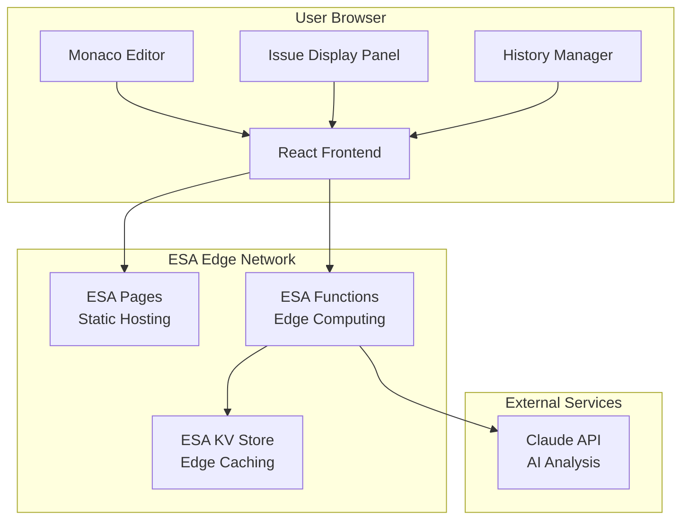

# Design Document: AI Code Reviewer

## Overview

CodeReview Pro is a single-page web application that provides real-time AI-powered code analysis. The system leverages Alibaba Cloud ESA (Edge Security Acceleration) infrastructure to deliver a fast, secure, and globally distributed code review experience. Users can input code through multiple methods and receive categorized feedback on security, performance, and style issues.

The application follows a modern edge-first architecture where the React frontend is deployed on ESA Pages, backend logic runs on ESA Functions at the edge, and data is cached using ESA KV Store for optimal performance. AI analysis is provided through Claude API integration with intelligent caching and rate limiting.

## Architecture

### System Architecture



### Component Architecture

The frontend follows a modular React architecture with clear separation of concerns:

- **App Container**: Main application state and routing
- **Code Editor**: Monaco Editor wrapper with language detection and syntax highlighting
- **Analysis Engine**: Handles API communication and result processing
- **Issue Display**: Renders categorized code issues with interactive highlighting
- **History Manager**: Manages local storage and review history
- **Export Service**: Generates reports in multiple formats
- **Theme Provider**: Handles dark/light mode and internationalization

### Data Flow

1. **Code Input**: User inputs code via editor or file upload
2. **Language Detection**: System automatically detects programming language
3. **Analysis Request**: Code sent to ESA Functions with caching check
4. **AI Processing**: ESA Functions call Claude API for code analysis
5. **Result Caching**: Analysis results cached in ESA KV Store
6. **Issue Display**: Frontend renders categorized issues with line highlighting
7. **History Storage**: Results stored locally for quick access

## Components and Interfaces

### Frontend Components

#### CodeEditor Component
```typescript
interface CodeEditorProps {
  value: string;
  language: string;
  onChange: (value: string) => void;
  onLanguageChange: (language: string) => void;
  highlightedLines: number[];
  theme: 'light' | 'dark';
}

interface EditorActions {
  setValue: (code: string) => void;
  highlightLines: (lines: number[]) => void;
  clearHighlights: () => void;
  focus: () => void;
}
```

#### IssuePanel Component
```typescript
interface Issue {
  id: string;
  type: 'security' | 'performance' | 'style';
  severity: 'critical' | 'high' | 'medium' | 'low';
  title: string;
  description: string;
  suggestion: string;
  codeExample?: string;
  line: [number, number];
  column: [number, number];
}

interface IssuePanelProps {
  issues: Issue[];
  onIssueClick: (issue: Issue) => void;
  filterType?: 'security' | 'performance' | 'style' | 'all';
  onFilterChange: (filter: string) => void;
}
```

#### HistoryManager Component
```typescript
interface ReviewHistory {
  id: string;
  code: string;
  language: string;
  timestamp: number;
  issueCount: number;
  summary: {
    critical: number;
    high: number;
    medium: number;
    low: number;
  };
}

interface HistoryManagerProps {
  history: ReviewHistory[];
  onHistorySelect: (item: ReviewHistory) => void;
  onHistoryDelete: (id: string) => void;
  onHistoryClear: () => void;
}
```

### Backend Interfaces

#### ESA Functions API
```typescript
// Request Interface
interface ReviewRequest {
  code: string;
  language: string;
  requestId: string;
  timestamp: number;
}

// Response Interface
interface ReviewResponse {
  status: 'success' | 'error';
  requestId: string;
  issues: Issue[];
  summary: {
    totalIssues: number;
    critical: number;
    high: number;
    medium: number;
    low: number;
    processingTime: number;
  };
  cached: boolean;
}

// Error Response Interface
interface ErrorResponse {
  status: 'error';
  code: string;
  message: string;
  requestId: string;
}
```

#### ESA KV Store Schema
```typescript
// Cache Key Patterns
type CacheKey = `review:${string}:${string}`; // review:{hash}:{language}
type HistoryKey = `history:${string}:${number}`; // history:{userId}:{index}
type PrefsKey = `prefs:${string}`; // prefs:{userId}

// Cached Review Data
interface CachedReview {
  issues: Issue[];
  summary: ReviewSummary;
  timestamp: number;
  language: string;
  codeHash: string;
}
```

### AI Integration Interface

#### Claude API Integration
```typescript
interface AIAnalysisRequest {
  code: string;
  language: string;
  analysisTypes: ('security' | 'performance' | 'style')[];
}

interface AIPromptTemplate {
  systemPrompt: string;
  userPrompt: string;
  responseFormat: 'json';
  maxTokens: number;
}
```

## Data Models

### Core Data Models

#### Code Analysis Model
```typescript
interface CodeAnalysis {
  id: string;
  code: string;
  language: string;
  issues: Issue[];
  metadata: {
    timestamp: number;
    processingTime: number;
    aiModel: string;
    cacheHit: boolean;
  };
  summary: AnalysisSummary;
}

interface AnalysisSummary {
  totalIssues: number;
  severityBreakdown: {
    critical: number;
    high: number;
    medium: number;
    low: number;
  };
  typeBreakdown: {
    security: number;
    performance: number;
    style: number;
  };
}
```

#### User Preferences Model
```typescript
interface UserPreferences {
  theme: 'light' | 'dark' | 'auto';
  language: 'en' | 'zh-CN';
  editor: {
    fontSize: number;
    tabSize: number;
    wordWrap: boolean;
    minimap: boolean;
  };
  analysis: {
    autoAnalyze: boolean;
    enabledTypes: ('security' | 'performance' | 'style')[];
    severityFilter: ('critical' | 'high' | 'medium' | 'low')[];
  };
}
```

#### Export Models
```typescript
interface ExportOptions {
  format: 'pdf' | 'markdown' | 'json';
  includeCode: boolean;
  includeMetadata: boolean;
  severityFilter?: ('critical' | 'high' | 'medium' | 'low')[];
  typeFilter?: ('security' | 'performance' | 'style')[];
}

interface ExportResult {
  format: string;
  content: string | Blob;
  filename: string;
  size: number;
}
```

### Storage Models

#### Local Storage Schema
```typescript
interface LocalStorageData {
  'codereview_history': ReviewHistory[];
  'codereview_preferences': UserPreferences;
  'codereview_lastSession': {
    code: string;
    language: string;
    timestamp: number;
  };
  'codereview_cache': {
    [key: string]: CachedReview;
  };
}
```

#### ESA KV Store Data Structure
```typescript
// Review Cache (TTL: 24 hours)
interface ReviewCacheEntry {
  key: string; // review:{codeHash}:{language}
  value: {
    issues: Issue[];
    summary: AnalysisSummary;
    timestamp: number;
    aiModel: string;
  };
  ttl: 86400; // 24 hours
}

// Rate Limiting (TTL: 1 hour)
interface RateLimitEntry {
  key: string; // ratelimit:{clientId}:{hour}
  value: {
    requests: number;
    firstRequest: number;
  };
  ttl: 3600; // 1 hour
}
```

## Correctness Properties

*A property is a characteristic or behavior that should hold true across all valid executions of a system—essentially, a formal statement about what the system should do. Properties serve as the bridge between human-readable specifications and machine-verifiable correctness guarantees.*

### Property 1: Code Editor Syntax Highlighting
*For any* valid code input in a supported programming language, the Code_Editor should apply appropriate syntax highlighting based on the detected or specified language.
**Validates: Requirements 1.1, 1.3**

### Property 2: File Upload and Language Detection
*For any* uploaded file with a supported extension, the system should correctly load the file content and detect the programming language based on the file extension or content analysis.
**Validates: Requirements 1.2, 1.3**

### Property 3: Editor Keyboard Shortcuts
*For any* standard keyboard shortcut (Ctrl+Z, Ctrl+Y, Ctrl+A), the Code_Editor should respond with the appropriate operation (undo, redo, select all) when the shortcut is triggered.
**Validates: Requirements 1.4**

### Property 4: Code Size Validation
*For any* code input exceeding 50KB, the system should prevent submission and display a size limit warning message.
**Validates: Requirements 1.5**

### Property 5: Analysis Response Time
*For any* code review request, the Review_Engine should initiate the AI analysis within 3 seconds of the user clicking the review button.
**Validates: Requirements 2.1**

### Property 6: Comprehensive Issue Detection
*For any* code sample containing security vulnerabilities, performance issues, or style violations, the AI_Analyzer should detect and categorize these issues with appropriate severity levels.
**Validates: Requirements 2.2, 2.3, 2.4**

### Property 7: Suggestion Quantity
*For any* completed code analysis, the system should return between 3 and 5 actionable suggestions per code submission.
**Validates: Requirements 2.5**

### Property 8: Issue Display Formatting
*For any* analysis result containing issues, the Issue_Panel should display each issue as a distinct card containing type icon, severity level, and description.
**Validates: Requirements 3.1**

### Property 9: Issue Highlighting Interaction
*For any* issue card clicked by the user, the Code_Editor should highlight the corresponding line numbers specified in the issue data.
**Validates: Requirements 3.2**

### Property 10: Issue Type Visual Styling
*For any* issue displayed in the Issue_Panel, the visual styling (color and icon) should correctly correspond to the issue type: red/lock for security, yellow/lightning for performance, blue/document for style.
**Validates: Requirements 3.3, 3.4, 3.5**

### Property 11: Issue Filtering
*For any* filter selection applied to the Issue_Panel, only issues matching the selected type should be displayed while others are hidden.
**Validates: Requirements 3.6**

### Property 12: History Storage
*For any* completed code review, the History_Manager should store the code, language, timestamp, and results in local storage.
**Validates: Requirements 4.1**

### Property 13: History Display Limit
*For any* history view request, the system should display only the most recent 20 code review sessions, regardless of how many total sessions exist.
**Validates: Requirements 4.2**

### Property 14: History Restoration
*For any* history entry clicked by the user, the system should restore the associated code and review results to the main interface.
**Validates: Requirements 4.3**

### Property 15: History Management Operations
*For any* history deletion request (single entry or all entries), the History_Manager should remove the specified records and update the display accordingly.
**Validates: Requirements 4.4**

### Property 16: History Loading Performance
*For any* history data access request, the system should load and display the entries within 500 milliseconds.
**Validates: Requirements 4.5**

### Property 17: Multi-Format Export Generation
*For any* export request (PDF, Markdown, or JSON), the Export_Service should generate a properly formatted document containing code, issues, timestamp, programming language, and complete issue details.
**Validates: Requirements 5.1, 5.2, 5.3, 5.4**

### Property 18: Shareable Link Generation
*For any* review result when sharing functionality is enabled, the system should generate valid shareable links that allow access to the review results.
**Validates: Requirements 5.5**

### Property 19: Language Internationalization
*For any* language preference selection (Chinese or English), the system should display all interface text in the selected language.
**Validates: Requirements 6.1**

### Property 20: Theme Switching
*For any* theme toggle operation, the system should switch all UI elements between light and dark color schemes consistently.
**Validates: Requirements 6.2**

### Property 21: Accessibility Contrast Compliance
*For any* theme mode (light or dark), all UI elements should maintain contrast ratios that meet WCAG accessibility standards.
**Validates: Requirements 6.3**

### Property 22: Preference Persistence
*For any* user preference configuration, the settings should persist across browser sessions and be restored when the application loads.
**Validates: Requirements 6.4**

### Property 23: Keyboard Navigation Accessibility
*For any* application functionality, users should be able to access and operate all features using only keyboard navigation without requiring mouse interaction.
**Validates: Requirements 6.5**

### Property 24: Application Load Performance
*For any* application startup, the system should display the complete interface within 2 seconds of the initial page load.
**Validates: Requirements 7.1**

### Property 25: Editor Scrolling Performance
*For any* scrolling operation in the Code_Editor, the system should maintain 60 frames per second performance.
**Validates: Requirements 7.2**

### Property 26: Error Handling and Retry Logic
*For any* API call failure, the system should display user-friendly error messages and automatically retry the request up to 3 times before giving up.
**Validates: Requirements 7.3**

### Property 27: Offline Functionality
*For any* network connectivity limitation, the system should provide access to cached reviews and basic editing functionality without requiring network access.
**Validates: Requirements 7.4**

### Property 28: UI Responsiveness During Processing
*For any* large code file processing operation, the system should maintain a responsive user interface that allows user interaction during analysis.
**Validates: Requirements 7.5**

### Property 29: Encrypted Data Transmission
*For any* code submission for analysis, the system should transmit all data using encrypted HTTPS/TLS connections only.
**Validates: Requirements 8.1**

### Property 30: API Key Security
*For any* API key usage, the system should store credentials securely in backend services without exposing them in frontend code or network requests.
**Validates: Requirements 8.3**

### Property 31: Sensitive Information Detection
*For any* code containing sensitive information (API keys, passwords, tokens), the system should detect and warn users about potential security risks.
**Validates: Requirements 8.4**

### Property 32: Secure Caching with Expiration
*For any* user data cached by the system, the storage should use secure local storage or edge storage with appropriate expiration times.
**Validates: Requirements 8.5**

## Error Handling

### Client-Side Error Handling

**Network Errors**: Implement exponential backoff retry logic with user-friendly error messages. Cache requests locally when possible and retry when connectivity is restored.

**Validation Errors**: Provide immediate feedback for invalid inputs (file size, unsupported formats) with clear guidance on how to resolve issues.

**Editor Errors**: Handle Monaco Editor initialization failures gracefully with fallback to basic textarea input.

**Storage Errors**: Detect localStorage quota exceeded errors and provide options to clear old data or export important reviews.

### Server-Side Error Handling

**AI API Failures**: Implement circuit breaker pattern to prevent cascading failures. Provide cached results when available or graceful degradation messages.

**Rate Limiting**: Return appropriate HTTP status codes (429) with retry-after headers. Implement client-side rate limiting to prevent unnecessary requests.

**Input Validation**: Sanitize and validate all inputs on the server side. Reject malicious code patterns and oversized requests.

**ESA KV Store Errors**: Handle cache misses gracefully and continue operation without cached data. Implement fallback storage mechanisms.

### Error Recovery Strategies

**Auto-Save**: Automatically save user code to localStorage every 30 seconds to prevent data loss.

**Session Recovery**: Restore user session state on page reload, including unsaved code and analysis results.

**Graceful Degradation**: Continue core functionality even when advanced features (export, sharing) fail.

## Testing Strategy

### Dual Testing Approach

The testing strategy employs both unit testing and property-based testing to ensure comprehensive coverage:

**Unit Tests**: Verify specific examples, edge cases, and error conditions
- Component rendering with specific props
- API response handling for known scenarios  
- File upload with various file types
- Theme switching behavior
- Export generation for sample data

**Property Tests**: Verify universal properties across all inputs
- Code editor behavior with randomly generated code samples
- Issue detection across various code patterns
- UI responsiveness with different data sizes
- Security validation with generated sensitive data patterns

### Property-Based Testing Configuration

**Testing Library**: Use `fast-check` for JavaScript/TypeScript property-based testing
**Test Iterations**: Minimum 100 iterations per property test to ensure comprehensive input coverage
**Test Tagging**: Each property test must reference its design document property using the format:
`// Feature: ai-code-reviewer, Property {number}: {property_text}`

### Test Categories

**Frontend Component Tests**:
- Monaco Editor integration and language detection
- Issue panel rendering and interaction
- History management and persistence
- Export functionality across formats
- Theme and internationalization switching

**API Integration Tests**:
- ESA Functions request/response handling
- Claude API integration and error handling
- Caching behavior with ESA KV Store
- Rate limiting and retry logic

**End-to-End Property Tests**:
- Complete code review workflow from input to results
- Cross-browser compatibility and performance
- Accessibility compliance across all features
- Security validation and data protection

**Performance Tests**:
- Load time measurement and optimization
- Memory usage during large file processing
- Network request optimization and caching effectiveness
- UI responsiveness under various load conditions

Each correctness property will be implemented as a single property-based test that validates the universal behavior across all valid inputs, ensuring the system maintains correctness regardless of the specific data provided.