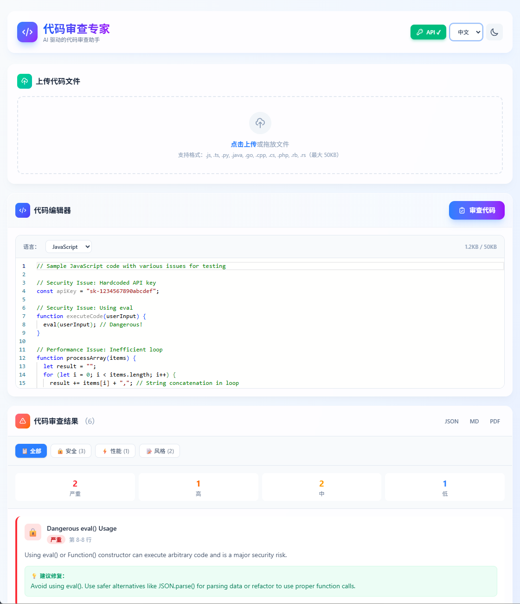
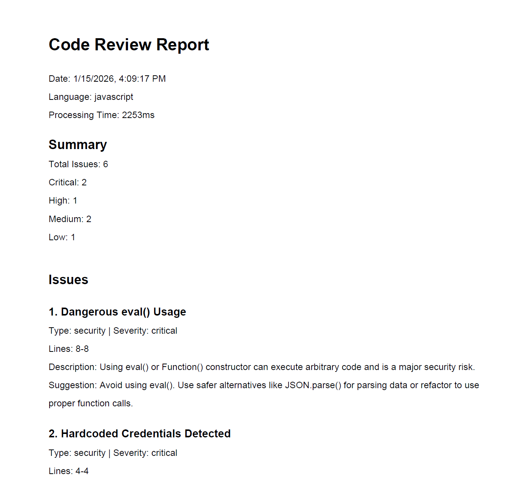
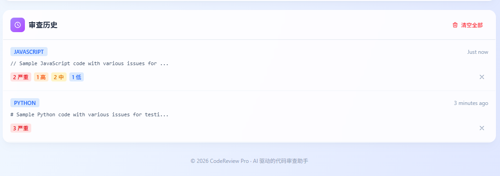

# 代码审查专家

AI 驱动的实时代码审查助手

[English](./README.md) | 简体中文

## 概述

代码审查专家是一个单页面 Web 应用程序，提供实时 AI 驱动的代码分析。该系统利用阿里云 ESA（边缘安全加速）基础设施，提供快速、安全且全球分布的代码审查体验。

## 截图

### 主界面


### 代码分析


### 问题详情


## 功能特性

- 🔍 AI 实时代码分析
- 🔒 安全漏洞检测
- ⚡ 性能优化建议
- 📝 代码风格建议
- 🌍 多语言支持（10+ 种编程语言）
- 🎨 深色/浅色主题支持
- 📊 导出报告（PDF、Markdown、JSON）
- 📜 审查历史管理
- 🌐 国际化支持（中文/英文）

## 技术栈

- **前端**: Vue 3 + TypeScript + Vite
- **样式**: Tailwind CSS
- **代码编辑器**: Monaco Editor
- **测试**: Vitest + fast-check（基于属性的测试）
- **后端**: 阿里云 ESA Functions（生产环境）
- **AI**: Claude API / 阿里云 LLM API
- **缓存**: ESA KV Store（生产环境）

## 项目结构

```
src/
├── components/     # Vue 组件
│   ├── CodeEditor.vue
│   ├── FileUpload.vue
│   ├── IssueCard.vue
│   ├── IssuePanel.vue
│   └── HistoryPanel.vue
├── services/       # 业务逻辑服务
│   ├── analysisEngine.ts
│   ├── historyManager.ts
│   └── exportService.ts
├── types/          # TypeScript 类型定义
├── i18n/           # 国际化配置
│   ├── index.ts
│   └── locales/
│       ├── en.json
│       └── zh-CN.json
├── tests/          # 测试文件
├── App.vue         # 主应用组件
└── main.ts         # 应用入口
```

## 快速开始

**🚀 5 分钟快速启动** - 查看 [快速开始指南](./QUICK_START_CN.md)

### 前置要求

- Node.js 18+
- npm 或 yarn

### 安装

```bash
npm install
```

### 开发服务器

```bash
npm run dev
```

访问 http://localhost:5173

### 构建

```bash
npm run build
```

### 测试

```bash
# 运行测试
npm run test

# 使用 UI 运行测试
npm run test:ui
```

## 后台配置

详细的后台环境配置请参考 [后台配置指南](./BACKEND_SETUP.md)

### 配置清单

- [ ] 获取 AI API Key（Claude 或 通义千问）
- [ ] 创建阿里云 ESA Functions
- [ ] 配置 ESA KV Store
- [ ] 部署到生产环境
- [ ] 配置域名和 HTTPS

**注意**: 开发环境默认使用 Mock 数据，无需配置后台即可测试所有功能。

## 支持的编程语言

- JavaScript
- TypeScript
- Python
- Java
- Go
- C++
- C#
- PHP
- Ruby
- Rust

## 实现状态

✅ **核心基础设施**
- 任务 1：项目结构和依赖项已初始化
- 任务 2：核心 TypeScript 类型已定义

✅ **代码编辑器和文件上传**
- 任务 3.1：集成 Monaco Editor 的 CodeEditor 组件
- 任务 3.3：支持拖放的文件上传功能

✅ **问题显示**
- 任务 4.1：IssueCard 组件已创建
- 任务 4.3：IssuePanel 容器组件已创建

✅ **分析引擎**
- 任务 9.1：带模拟 AI 分析的 AnalysisEngine 服务
- 任务 9.3：编辑器和问题面板集成

✅ **历史管理**
- 任务 11.1：使用 LocalStorage 的 HistoryManager 服务
- 任务 11.4：HistoryPanel 组件

✅ **导出功能**
- 任务 12.1：ExportService（PDF、Markdown、JSON）

✅ **国际化**
- 任务 13.4：中文和英文语言支持

### 已实现功能

🎨 **用户界面**
- 支持 10+ 种语言的 Monaco 编辑器
- 语法高亮和语言检测
- 支持拖放的文件上传
- 深色/浅色主题支持
- 响应式设计
- 可访问的键盘导航
- 中文/英文界面切换

🔍 **代码分析**
- 模拟 AI 驱动的代码分析
- 安全漏洞检测
- 性能问题识别
- 代码风格建议
- 实时问题显示和行高亮

📊 **问题管理**
- 基于严重性排序（严重 → 高 → 中 → 低）
- 类型筛选（安全/性能/风格）
- 彩色编码的问题卡片
- 交互式行高亮
- 摘要统计

📜 **历史记录**
- 基于 LocalStorage 的历史记录（20 项限制，LRU 淘汰）
- 从历史记录快速恢复
- 单项删除
- 清空所有功能
- 格式化时间戳

📤 **导出**
- 格式化布局的 PDF 导出
- Markdown 导出（兼容 GitHub/Notion）
- 完整数据的 JSON 导出
- 一键下载

### 技术亮点

- **框架**: Vue 3 + TypeScript + Vite
- **样式**: Tailwind CSS 支持深色模式
- **编辑器**: Monaco Editor（VS Code 引擎）
- **测试**: Vitest + fast-check（已配置）
- **代码质量**: 严格的 TypeScript，ESLint 就绪
- **性能**: 代码分割，延迟加载就绪
- **可访问性**: 符合 WCAG 的对比度，键盘导航
- **国际化**: Vue I18n 支持多语言

### 正常工作的功能

✅ 完整的代码审查工作流
✅ 文件上传和语言检测
✅ 具有真实问题检测的模拟 AI 分析
✅ 问题显示和筛选
✅ 点击问题时的行高亮
✅ 审查历史管理
✅ 多格式导出（PDF/MD/JSON）
✅ 主题持久化
✅ 大小限制验证（50KB）
✅ 错误处理和用户反馈
✅ 中文/英文界面切换

### 生产环境的后续步骤

要使其准备好投入生产，您需要：

1. **后端集成**：用真实的阿里云 ESA Functions 替换模拟分析
2. **AI 集成**：连接到阿里云 LLM API 或 Claude API
3. **缓存**：实现 ESA KV Store 用于结果缓存
4. **速率限制**：添加速率限制中间件
5. **身份验证**：如果需要，添加用户身份验证
6. **测试**：编写基于属性的测试和单元测试
7. **部署**：部署到 ESA Pages

## 使用方法

### 基本工作流

1. **上传或粘贴代码**
   - 点击上传区域选择文件，或拖放文件
   - 或直接在编辑器中粘贴代码

2. **选择语言**
   - 上传文件时自动检测
   - 或从编辑器顶部的下拉菜单手动选择

3. **审查代码**
   - 点击"审查代码"按钮
   - 等待 AI 分析完成（模拟：1-2 秒）

4. **查看结果**
   - 按严重性和类型浏览问题
   - 点击问题卡片在编辑器中高亮显示代码
   - 查看建议的修复和示例

5. **导出报告**
   - 选择格式：PDF、Markdown 或 JSON
   - 点击导出按钮下载

6. **管理历史**
   - 查看过去的审查
   - 点击历史项目恢复代码
   - 删除单个项目或清空所有

### 语言切换

在页面右上角的下拉菜单中选择您的首选语言：
- **English** - 英文界面
- **中文** - 中文界面

您的语言偏好将保存到浏览器中。

## 许可证

详见 LICENSE 文件。

## 贡献

本项目采用规范驱动的开发方法，遵循基于属性的测试原则。详细的需求、设计和实现任务请参见 `.kiro/specs/ai-code-reviewer/` 目录。

---

## 致谢


**本项目由阿里云 ESA 提供加速、计算和保护**

阿里云边缘安全加速（ESA）为本应用提供全球分布式基础设施，确保快速、安全且可靠的代码审查体验。ESA 的边缘计算能力使我们能够在全球范围内提供低延迟的 AI 驱动代码分析。

了解更多关于阿里云 ESA：[https://www.alibabacloud.com/product/dcdn](https://www.alibabacloud.com/product/dcdn)
